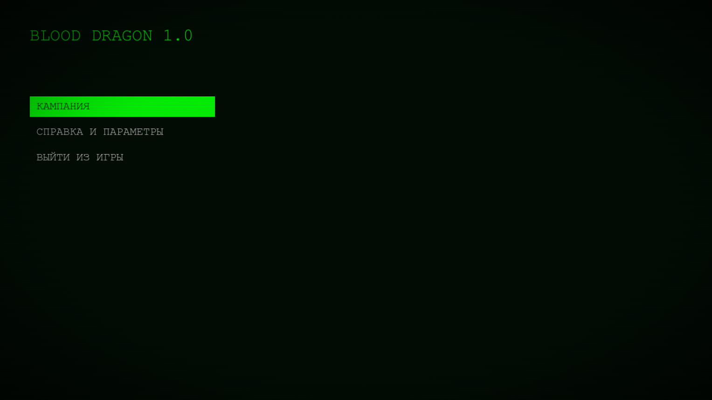
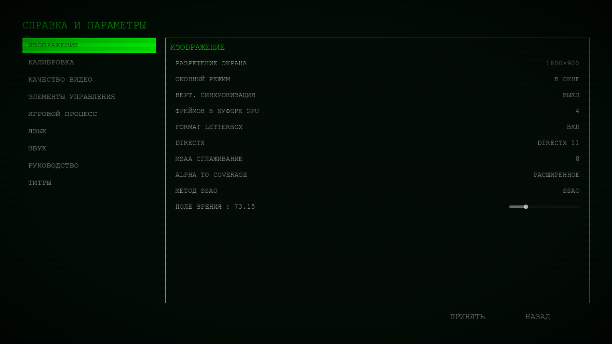
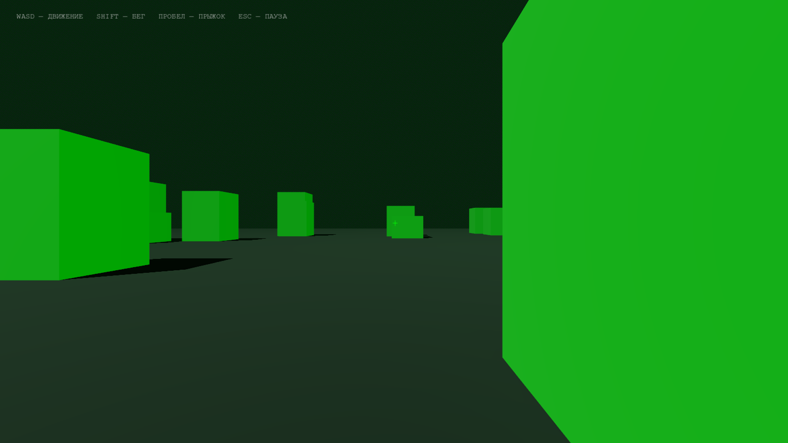

# Blood Dragon Menu

Система главного меню и экрана **«Справка и параметры»** в стиле Far Cry 3: Blood Dragon.

Движок: **Godot 4.7 .NET** (рекомендуется 4.7.2). Язык: **C# / .NET 8**. Автор репозитория: [assassins377](https://github.com/assassins377).

Это не полная игра, а рабочий UI-каркас: навигация, сохранение настроек, CRT-оверлей, звук меню и заглушка 3D-уровня, чтобы сразу проверить графику и управление.

Полная постановка: [`game_menu_specification.md`](game_menu_specification.md). Лицензия: [MIT](LICENSE).

---

## Скриншоты

Реальные кадры из запущенного проекта (1920×1080, CRT scanlines).

### Главное меню



Тёмный фон `#020d05`, неоновый акцент `#00ff00`. Заголовок с мигающим курсором `█`. Активная кнопка — сплошная зелёная плашка, текст тёмный. Неактивные пункты — серый моноширинный текст без рамки.

### Справка и параметры



Две колонки: слева список категорий, справа панель в зелёной рамке. **Принять** записывает буфер в `user://settings.cfg` и применяет к движку. **Назад** выходит без применения.

### Заглушка кампании



Кампания открывает простой 3D-полигон: движение, бег, прыжок, пауза. Нужен, чтобы настройки (FOV, MSAA, тени, громкость, бинды) было куда применять.

---

## Что умеет

| Экран | Поведение |
|--------|-----------|
| Главное меню | Кампания / справка / выход, CRT, эмбиент, hover/select SFX |
| Справка и параметры | Категории, буфер изменений, Принять / Назад, Esc = назад |
| Игра | First-person заглушка + применение графики через `GraphicsController` |

### Категории настроек

| Категория | Содержание |
|-----------|------------|
| Изображение | разрешение, окно/полный экран, VSync, GPU frames, letterbox, DirectX, MSAA, A2C, SSAO, FOV |
| Калибровка | яркость, контраст, гамма (шейдер) |
| Качество видео | общее / текстуры / тени / свет / пост / вода / дальность |
| Элементы управления | чувствительность мыши и геймпада, инверсия Y, переназначение клавиш |
| Игровой процесс | сложность, подсказки, автоприцеливание |
| Язык | UI, озвучка, субтитры, размер шрифта |
| Звук | Master / Music / SFX / Dialogue / Ambient, динамический диапазон, вывод, озвучка меню |
| Руководство | статичный текст |
| Титры | версия, движок, лицензии |

Навигация: мышь, стрелки / Enter / Esc, геймпад. Геймпад игнорируется, пока окно не в фокусе (настройка Godot 4.7).

Кнопки главного меню заезжают слева через **Control offset transforms** (Godot 4.7): анимация визуальная, hitbox остаётся на месте layout.

---

## Требования и запуск

- Godot **4.7 .NET** (не standard / GDScript-only)
- **.NET 8** SDK

1. Клонируйте репозиторий и откройте папку в Godot 4.7 (.NET).
2. Дождитесь восстановления NuGet и сборки C#.
3. Запустите проект: главная сцена — `scenes/main_menu/MainMenu.tscn`.

Autoload: `SettingsManager`, `AudioManager`.

---

## Архитектура (кратко)

| Часть | Где |
|--------|-----|
| Модель настроек | `scripts/settings/GameSettings.cs` |
| Сохранение / применение | `scripts/settings/SettingsManager.cs` → `user://settings.cfg` |
| Главное меню | `scripts/menus/MainMenu.cs` |
| Экран параметров | `scripts/menus/SettingsMenu.cs` + панели в `scenes/settings_menu/categories/` |
| Строки UI | `CycleOption`, `SliderRow`, `KeyBindingRow` |
| Тема | `scripts/ui/MenuTheme.cs` (палитра, моноширинный шрифт) |
| Графика в игре | `scripts/game/GraphicsController.cs` |
| CRT / калибровка | `shaders/` |

```
scenes/     главное меню, настройки, заглушка уровня
scripts/    C#: меню, настройки, аудио, игрок
shaders/    CRT, glow, калибровка
audio/      эмбиент меню и UI-звуки
screenshots/  кадры для README
```

---

## Лицензия

MIT. Godot Engine — MIT.

Визуальный язык вдохновлён Far Cry 3: Blood Dragon; это фанатский UI-прототип, не связанный с Ubisoft.
